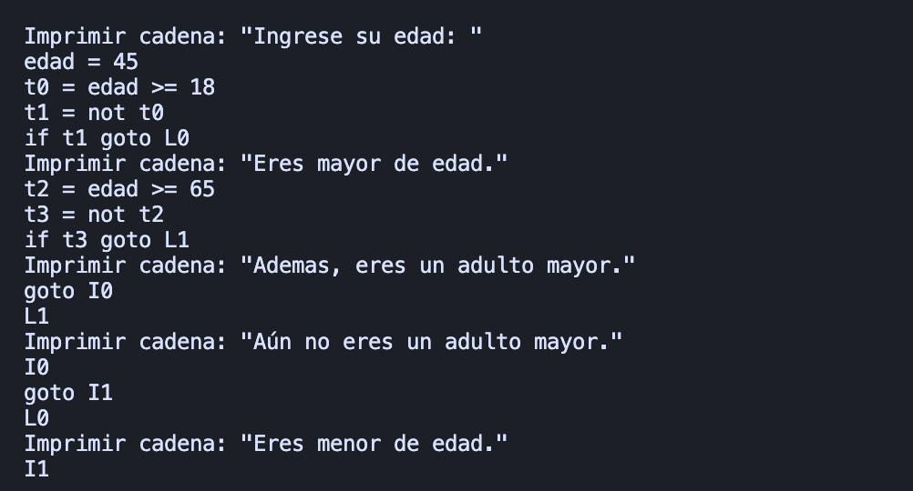

# compilers-hw-5-6
- Se tiene un único código que incluye las mejoras en el while e if
- El código aplica tanto para la tarea 5 y tarea 6

## Gramática
### Declaraciones y bloque principal
- S --> M 
- S --> D M 
- D --> INT identifier_list FINAL_LINEA
- identifier_list --> IDENTIFICADOR
- identifier_list --> identifier_list COMA IDENTIFICADOR
- M --> MAIN PARENTESIS_A PARENTESIS_C LLAVE_A C LLAVE_C

### Código
- C --> A FINAL_LINEA C 
- C --> PUTS PARENTESIS_A CONST_CADENA PARENTESIS_C FINAL_LINEA C
- C --> PUTW PARENTESIS_A E PARENTESIS_C FINAL_LINEA C
- C --> I C
- C --> W C
- C --> e

### Condicionales y bucles
- I => IF PARENTESIS_A B PARENTESIS_C if_block
- if_block => LLAVE_A C LLAVE_C
- if_block => LLAVE_A C LLAVE_C ELSE LLAVE_A C LLAVE_C
- W => WHILE PARENTESIS_A B PARENTESIS_C LLAVE_A C LLAVE_C

### Asignación y operaciones booleanas
- A => V ASIGNACION E
- B => E MENOR E
- B => E MAYOR E
- B => E MENOR_IGUAL E
- B => E MAYOR_IGUAL E
- B => E IGUALDAD E
- B => E DESIGUALDAD E

### Operaciones aritméticas
- E => E SUMA E
- E => E RESTA E
- E => E MULTIPLICACION E
- E => E DIVISION E
- E => E DIVISION_ENTERA E
- E => PARENTESIS_A E PARENTESIS_C
- E => V
- E => NUMERO
- V => IDENTIFICADOR 

## Test Hw6
### Código
```c
int edad;
main() {
  puts("Ingrese edad: ")
  edad = 45
  
  if (edad >= 18) {
    puts("Eres mayor de edad.");
    if (edad >= 45) {
      puts("Además, un adulto mayor.");
    } else {
      puts("Aún no eres un adulto mayor.");
    }
  } else {
    puts("Eres menor de edad.");
  }
}
```
### Output: 
#### Código en tres direcciones


